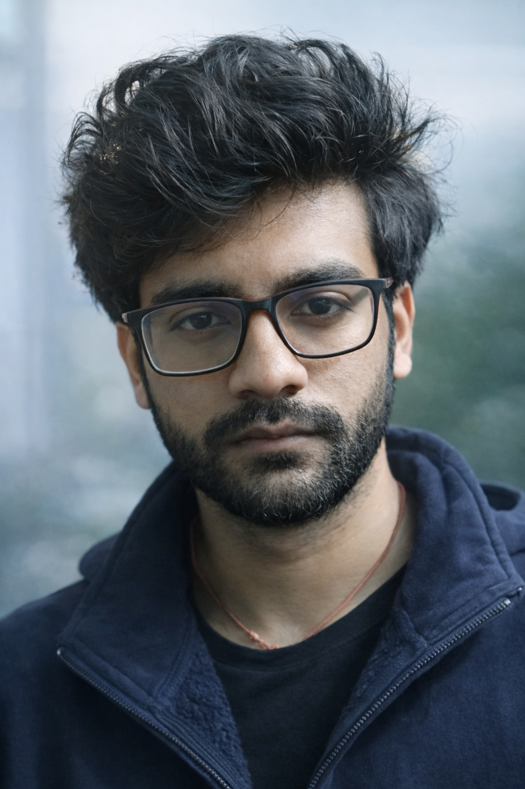

# 👋 Ayush Kumar Shaw

**B.Tech Computer Science @ NIT Durgapur (Class of 2027)**
*Applied Machine Learning • Generative AI • Production-Grade Systems*

  

  <a href="mailto:ayushaks099@gmail.com">📧 ayushaks099@gmail.com</a> •
  <a href="https://linkedin.com/in/ayush-shaw-231b86325">LinkedIn</a> •
  <a href="https://github.com/ayushaks999">GitHub</a>

 

---

## 🚀 About Me

I’m **Ayush Kumar Shaw**, a Computer Science undergraduate at **NIT Durgapur**, focused on building **production-ready AI systems** that deliver real-world impact.

My work sits at the intersection of **Applied ML, Generative AI, and robust software engineering**—turning research ideas and prototypes into **scalable, observable, and maintainable systems**. I build agentic RAG platforms, multimodal ML pipelines, and data-intensive AI applications with a strong emphasis on explainability, evaluation, and deployment readiness.

📍 Durgapur, India • 🎓 NIT Durgapur • 📩 [ayushaks099@gmail.com](mailto:ayushaks099@gmail.com)

---

## 🧠 Core Expertise

* **RAG & Generative AI** — Retrieval-augmented generation, hybrid retrieval, agentic workflows
* **Machine Learning & Deep Learning** — Transformers, Vision Transformers, CNNs, uncertainty estimation
* **Systems & MLOps** — scalable ingestion pipelines, vector databases, streaming inference, reproducibility
* **Software Engineering** — Python, C++, SQL, Docker, CI/CD, Streamlit, Flask

---

## 🏗️ Featured Projects

### 🌊 ARGO RAG Explorer — *Oceanographic ML + RAG Platform*

An end-to-end scientific ML + RAG platform that converts **ARGO NetCDF ocean profiles** into a structured, queryable database. The system integrates vector search with retrieval-augmented generation to provide provenance-tracked answers and supports multi-model forecasting with uncertainty estimation.

**Tech:**
Python, Streamlit, xarray, SQLAlchemy, LangChain, ChromaDB, scikit-learn, XGBoost, LightGBM, Plotly
🔗 Repository: [https://github.com/ayushaks999/OceanForge_AI](https://github.com/ayushaks999/OceanForge_AI)

---

### ⚡ Agentic RAG — *Multi-PDF RAG Chatbot*

A production-grade, agentic RAG system for querying large document collections. Supports multi-PDF ingestion, semantic chunking, hybrid retrieval, streaming LLM responses, structured JSON outputs, and tool orchestration.

**Tech:**
Python, Streamlit, LangChain, ChromaDB, LLMs
🔗 Repository: [https://github.com/ayushaks999/RaG_Chatbot](https://github.com/ayushaks999/RaG_Chatbot)

---

### 🎤 AI Meeting Summarizer

A cross-platform meeting intelligence application that records meetings, performs real-time speech-to-text transcription, and generates concise summaries and actionable items.

**Tech:**
Electron, Python, Flask, Socket.IO, Deepgram, LLMs
🔗 Repository: [https://github.com/ayushaks999/AI-Meeting-Summarizer](https://github.com/ayushaks999/AI-Meeting-Summarizer)

---

### ✍️ Grammatical Error Correction — *Transformer-based NLP System*

An end-to-end **Grammatical Error Correction (GEC)** system built using Transformer architectures. The project focuses on data preprocessing, sequence-to-sequence modeling, and evaluation using standard NLP metrics to automatically correct grammatical errors in English text.

**Highlights:**

* Seq2Seq Transformer-based correction pipeline
* Tokenization and text normalization
* Quantitative evaluation using BLEU / SacreBLEU-style metrics

**Tech:**
Python, TensorFlow, Transformers, Datasets, SentencePiece
🔗 Repository: [https://github.com/ayushaks999/Grammatical_Error_correction](https://github.com/ayushaks999/Grammatical_Error_correction)

---

### 🤟 Sign Language Recognition — *Vision-based Gesture Classification*

A computer vision project for **sign language recognition** that classifies hand gestures from image/video inputs. Designed to improve accessibility by bridging communication between sign language users and non-signers.

**Highlights:**

* Image preprocessing and feature extraction
* CNN-based gesture classification
* Real-time inference-ready pipeline

**Tech:**
Python, OpenCV, TensorFlow/Keras, CNNs
🔗 Repository: [https://github.com/ayushaks999/Sign_Language](https://github.com/ayushaks999/Sign_Language)

---

### 🦠 Malaria Cell Detection — *Medical Image Classification*

A deep learning–based system for **malaria detection from microscopic blood smear images**. Trained and evaluated on the TFDS Malaria dataset, focusing on reliable classification and medical-imaging best practices.

**Highlights:**

* Binary classification: Parasitized vs Uninfected cells
* CNN-based image classification pipeline
* Performance evaluation using confusion matrix and ROC curves

**Tech:**
Python, TensorFlow, OpenCV, scikit-learn
🔗 Repository: [https://github.com/ayushaks999/Malaria_Prediction](https://github.com/ayushaks999/Malaria_Prediction)

---

## 🧾 Resume

📄 [Download my resume (PDF)](./assets/Ayush_Shaw_Offcampus.pdf)

---

## 🔍 What I’m Looking For

**Seeking:** Machine Learning, Generative AI, and Software Development internship roles where strong engineering meets applied research.

---

## 🔗 Quick Links

* GitHub: [https://github.com/ayushaks999](https://github.com/ayushaks999)
* LinkedIn: [https://linkedin.com/in/ayush-shaw-231b86325](https://linkedin.com/in/ayush-shaw-231b86325)
* LeetCode: [https://leetcode.com/u/ayushaks099](https://leetcode.com/u/ayushaks099)
* Codeforces: [https://codeforces.com/profile/ayushaks999](https://codeforces.com/profile/ayushaks999)
